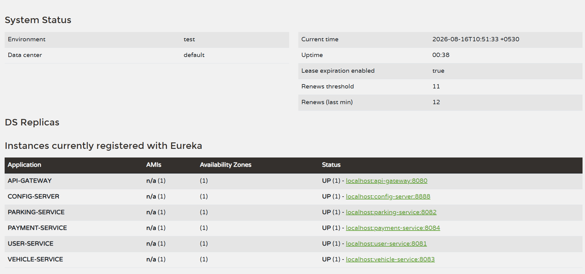

🅿️ Smart Parking Management System (SPMS)

The Smart Parking Management System (SPMS) is a cloud-native, microservices-based platform designed for real-time urban parking management.
The system lets drivers search, reserve, and pay for parking spaces, while parking owners manage their spaces and monitor availability dynamically.

🏗️ Architecture Overview

The system is built using a Distributed Microservices Architecture with the following components:

🔹 Infrastructure Services

**Service Registry (Netflix Eureka)**
Dynamic service registration and discovery.

**Config Server**
Centralized property management using a local native (classpath) configuration repository.

**API Gateway**
Single entry point for all requests, handling routing, JWT validation, and role-based access control.

🔹 Domain Microservices

**User Service**
Manages user identity, registration, login, and issues secure JWT tokens. Supports two roles: DRIVER and OWNER.

**Parking Service**
Manages parking spaces: creation, updates, availability tracking, reservation/release, and location-based filtering.

**Vehicle Service**
Manages vehicle registration and ownership, and simulates vehicle entry/exit tracking.

**Payment Service**
Handles mock card payment validation, simulates transaction success/failure, and generates digital receipts.

🚀 Startup Instructions (Order of Operations)

To ensure the system starts correctly, services must be launched in the following order:

**1️⃣ Infrastructure Layer**

- **Service Registry**
  Start the `service-registry` module
  Port: `8761`
  Dashboard: http://localhost:8761

- **Config Server**
  Start the `config-server` module
  Ensure the `configs` folder is accessible
  Port: `8888`

- **API Gateway**
  Start the `api-gateway` module
  Port: `8080`

**2️⃣ Domain Layer**

Start these services in any order once the infrastructure is up:

- **User Service** — Port: `8081` → Connects to `spms_user_db`
- **Parking Service** — Port: `8082` → Connects to `spms_parking_db`
- **Vehicle Service** — Port: `8083` → Connects to `spms_vehicle_db`
- **Payment Service** — Port: `8084` → Connects to `spms_payment_db`

🔐 Security Configuration

**Global Security**
Implemented at the API Gateway level via a global JWT filter.

**JWT Validation**
All requests require a valid Bearer Token, except the public endpoints below.

**Public Endpoints**
- `/api/users/register`
- `/api/users/login`

**Role-Based Access**
- **OWNER** — create, update, and delete their own parking spaces; view all payments/receipts across the system
- **DRIVER** — register, update, and delete their own vehicles; make payments; view their own profile and payment history
- Both roles can view/search parking spaces, reserve/release slots, and record vehicle entry/exit

🛠️ Technology Stack

| Category | Technology |
|---|---|
| Framework | Spring Boot 4.1.0 |
| Cloud Tools | Spring Cloud (Gateway, Eureka, Config) |
| Database | MySQL (one database per service) |
| Communication | Synchronous HTTP / JSON |
| Security | JWT & BCrypt Encryption |
| Utilities | Lombok, Jackson |

📂 Project Structure & Submission Files

- `/config-server/src/main/resources/configs` — Contains centralized YAML/properties configuration files per service
- `/docs/screenshots` — Contains Eureka Dashboard Screenshot showing all services UP
- `postman_collection.json` — Import into Postman to test the full system flow

🧪 Testing the System (Postman)

1. **Register / Login** — Obtain `accessToken` from User Service (register as both DRIVER and OWNER to test role-based access)
2. **Create Parking** — As OWNER, `POST /api/parking`
3. **Register Vehicle** — As DRIVER, `POST /api/vehicles`
4. **Simulate Entry/Exit** — `POST /api/vehicles/{id}/entry` and `/exit`
5. **Process Payment** — As DRIVER, `POST /api/payments`
6. **Verify Role Restrictions** — Confirm DRIVER gets `403` on parking creation, OWNER gets `403` on vehicle registration/payments

## Resources
- [Postman Collection](./postman_collection.json)
- 

👨‍💻 Developed By

Name: Ranuthi Pehansa Peiris